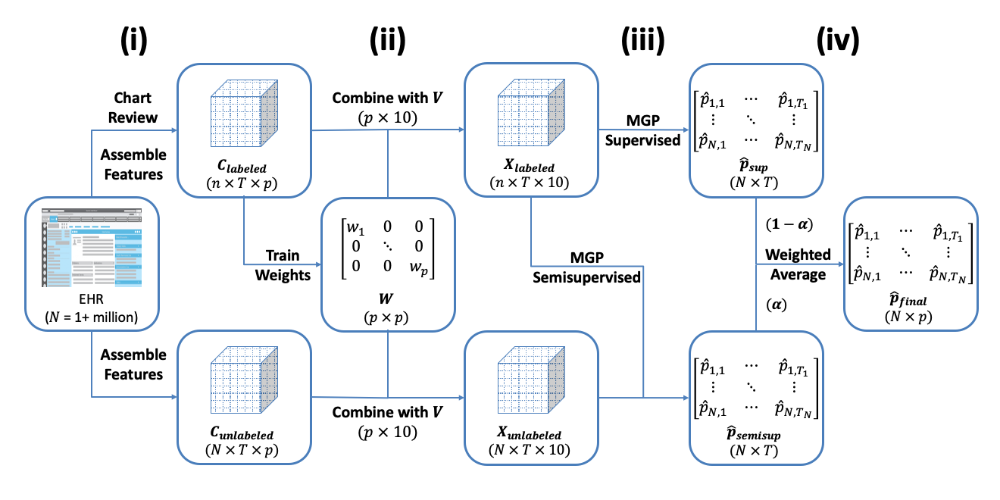

# SAMGEP: A Semi-Supervised Method for Prediction of Phenotype Event Times

[](https://CRAN.R-project.org/package=SAMGEP)

Leveraging large-scale electronic health record (EHR) data to estimate
survival curves for clinical events can enable more powerful risk
estimation and comparative effectiveness research. Semi-supervised
Calibration of Risk with Noisy Event Times (SCORNET) yields a consistent
and efficient survival curve estimator by leveraging a small size of
current status labels and a large size of imperfect surrogate features.



## Installation

Install stable version from CRAN:

``` r
install.packages("SAMGEP")
```

Install development version from GitHub:

``` r
# install.packages("remotes")
remotes::install_github("celehs/SAMGEP")
```

## Citation

Semi-supervised Calibration of Risk with Noisy Event Times (SCORNET)
Using Electronic Health Record Data. Yuri Ahuja, Liang Liang, Selena
Huang, Tianxi Cai. bioRxiv 2021.01.08.425976; doi:
<https://doi.org/10.1101/2021.01.08.425976>
